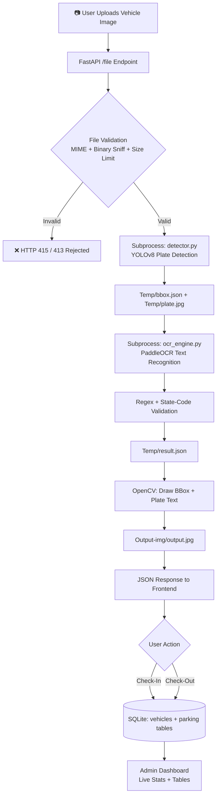

<div align="center">

# 🅿️ ParkX — Next-Generation Smart Parking System

**AI-powered Automatic Number Plate Recognition (ANPR) for real-time, contactless vehicle check-in and check-out.**

Built for malls, airports, corporate campuses, and gated communities.

[](https://www.python.org/)
[](https://fastapi.tiangolo.com/)
[](https://github.com/ultralytics/ultralytics)
[](https://github.com/PaddlePaddle/PaddleOCR)
[](https://www.sqlite.org/)
[](#license)

[Demo](#-demo) • [Features](#-features) • [Architecture](#-system-architecture) • [Tech Stack](#-tech-stack) • [Setup](#-getting-started) • [API](#-api-reference) • [Roadmap](#-roadmap--future-scope)

</div>

---

## 📖 Overview

**ParkX** is a full-stack, AI-driven smart parking management system that automates vehicle entry and exit using **computer vision** and **optical character recognition** — no manual number plate entry, no barcodes, no RFID cards required.

A user simply uploads (or a camera captures) an image of the vehicle. The system:

1. **Detects** the number plate in the image using a **custom-trained YOLOv8 model**.
2. **Crops and reads** the plate text using **PaddleOCR**.
3. **Validates** the extracted text against Indian number-plate formatting rules and state RTO codes.
4. **Logs** the check-in/check-out event to a persistent database.
5. Surfaces everything through a **live admin dashboard** with real-time stats.

This is **Version 2** of the project — evolved from a manually-triggered detection flow into a full computer-vision pipeline with a self-trained detection model, a decoupled OCR engine, and a FastAPI backend serving both a public kiosk-style UI and a password-protected admin panel.

---

## 🎥 Demo

> 📌 *Add your project demo here — this is one of the first things a recruiter looks at.*

| | |
|---|---|
| 🖼️ **Screenshots** | Add screenshots to a `/screenshots` folder and embed them below |
| 🎬 **Demo GIF** | A 10–15 sec looping GIF at the top of the README (upload flow → detection → check-in) gets seen *without a click* — highest impact per second of effort |
| ▶️ **Full walkthrough video** | Record a 60–90 sec screen capture (upload → detection → check-in → admin login → dashboard → check-out), upload to YouTube (unlisted is fine) or Loom, and link it below |

```markdown
<!-- Example once you have assets -->


| Home / Upload | Detection Result | Admin Dashboard | Admin Search |
|---|---|---|---|
|  |  |  |  |

📺 **[Watch the full demo video](https://your-video-link-here)**
```

**Recommendation:** Yes — add both. A short **autoplaying GIF** at the very top of the README does the most work for a recruiter skimming your repo in 15 seconds. A **linked full video** (60–90s) is what a recruiter clicks on *after* they've decided your project looks interesting — it proves the whole pipeline actually works end-to-end (upload → YOLO detection → OCR read → check-in → admin panel → check-out), which screenshots alone can't do.

---

## ✨ Features

### 🚘 Vehicle Detection & Recognition
- **Custom-trained YOLOv8 model** for license plate localization — trained specifically for this use case rather than relying on a generic object detector.
- **PaddleOCR-based text extraction** from the cropped plate region.
- **Post-processing validation engine**: strips whitespace/separators, removes stray `IND`/country prefixes, and regex-validates the result against the standard Indian plate format (`SS DD LLL DDDD`), cross-checked against a full list of valid RTO **state codes**.
- Automatically flags unreadable/invalid plates as `Cannot detect or Invalid` instead of silently trusting bad OCR output — with a manual fallback entry field on the frontend so an operator can still check a vehicle in/out.
- Annotated output image generated with **OpenCV**, drawing the bounding box and recognized plate number directly on the photo for visual confirmation.

### 🖥️ Decoupled, Production-Minded CV Pipeline
- Detection (**PyTorch/Ultralytics**) and OCR (**PaddlePaddle**) run in **isolated subprocesses**, deliberately avoiding the well-known runtime/CUDA-context conflicts between the two deep learning frameworks when loaded in the same process.
- Intermediate results (bounding box, recognized text, confidence score) are passed between stages via structured JSON files, making each stage independently testable and swappable.
- Confidence scores are captured and surfaced end-to-end from OCR to the API response.

### 🌐 Backend (FastAPI)
- Clean **REST API** built on FastAPI with Pydantic request models.
- **Two-layer file upload security**:
  1. Client-declared MIME type validation.
  2. **Binary content sniffing** via `filetype.guess()` to verify the file *actually is* an image, preventing spoofed/renamed file uploads.
- Enforced **2 MB upload size cap** with streamed chunk-based size checking.
- Static file serving for both the frontend assets and the generated annotated output images.
- CORS-enabled for flexible frontend integration.

### 🗄️ Database & Business Logic
- **SQLite** persistence layer with a clean relational schema:
  - `vehicles` — unique plate registry with vehicle type.
  - `parking` — one row per parking session, linked by foreign key, tracking `check_in_time`, `check_out_time`, and live `status` (`PARKED` / `COMPLETED`).
- **Idempotent check-in logic** — prevents double check-in of a vehicle that's already parked.
- **Safe check-out logic** — validates an active parking session exists before closing it out.
- Live aggregate statistics computed on demand: total registered vehicles, currently parked count, available capacity, and today's check-ins.

### 🛡️ Admin Dashboard
- Password-gated **admin panel** with a dedicated login screen.
- **Real-time stat cards**: Total Vehicles, Currently Parked, Available Slots, Today's Check-ins.
- Full **Vehicle Database** and **Parking Records** tables rendered live from the API.
- **Vehicle search**: look up a specific plate number to instantly pull its complete parking history — every check-in/check-out session, vehicle type, and status — via a dedicated `JOIN` query across the `vehicles` and `parking` tables, surfaced through a clean dedicated search view with its own navigation state.
- Clean navigation back to the public-facing kiosk view.

### 🎨 Frontend Experience
- Zero-framework, dependency-free **vanilla JS + HTML/CSS** kiosk interface — fast, lightweight, easy to deploy on low-power edge devices at a gate/boom-barrier.
- Custom-designed **scanning animation** (number-plate-styled loader with an animated scan line) while detection runs.
- Fully responsive result view: annotated image, recognized plate, OCR confidence %, and one-tap Check-In / Check-Out actions.
- Graceful manual-entry fallback when a plate can't be confidently read.

---

## 🏗️ System Architecture



**Why subprocesses?** YOLO (PyTorch) and PaddleOCR (PaddlePaddle) each initialize their own low-level runtime/device context. Running them in-process back-to-back in the same Python interpreter is a common source of memory conflicts and crashes. ParkX sidesteps this entirely by running each model as its own subprocess and communicating through JSON hand-off files — a small architectural decision that meaningfully improves reliability.

---

## 🧰 Tech Stack

| Layer | Technology |
|---|---|
| **Detection Model** | YOLOv8 (Ultralytics) — custom-trained on license plate data |
| **OCR Engine** | PaddleOCR |
| **Backend** | FastAPI, Uvicorn, Pydantic |
| **Image Processing** | OpenCV |
| **Database** | SQLite3 (raw SQL, no ORM) |
| **File Validation** | `filetype` (magic-byte content sniffing) |
| **Frontend** | HTML5, CSS3, Vanilla JavaScript, Jinja2 templating |
| **Process Isolation** | Python `subprocess` + JSON IPC |

---

## 📁 Project Structure

```
ParkX/
├── app.py                  # FastAPI application & route definitions
├── database.py              # SQLite schema, check-in/out & stats logic
├── detector.py               # YOLOv8 plate detection (runs as subprocess)
├── ocr_engine.py              # PaddleOCR text extraction & validation (runs as subprocess)
├── main.py                    # Standalone CLI test harness for the detection pipeline
├── Plate_Detection_&_Recognition.ipynb   # Model exploration / prototyping notebook
├── templates/
│   ├── index.html            # Public kiosk UI
│   └── adminContent.html      # Admin dashboard
├── static/
│   └── style.css               # App-wide styling
├── Models/
│   └── best.pt                  # Custom-trained YOLOv8 weights
├── Uploads/                       # Incoming vehicle images
├── Temp/                           # Inter-process bbox.json / result.json / plate.jpg
├── Output-img/                      # Annotated detection results
└── Parking.db                        # SQLite database
```

---

## 🚀 Getting Started

### Prerequisites
- Python 3.10+
- A trained YOLOv8 weights file at `Models/best.pt`

### Installation

```bash
git clone https://github.com/<your-username>/ParkX.git
cd ParkX

python -m venv venv
source venv/bin/activate        # Windows: venv\Scripts\activate

pip install -r requirements.txt
```

### Run the App

```bash
uvicorn app:app --reload
```

Then visit **http://localhost:8000** for the kiosk UI, and **http://localhost:8000/admincontent** for the admin panel.

---

## 📡 API Reference

| Method | Endpoint | Description |
|---|---|---|
| `GET` | `/` | Kiosk / upload UI |
| `POST` | `/file` | Upload a vehicle image → runs full detection + OCR pipeline |
| `POST` | `/check-in` | Check a vehicle into the parking lot |
| `POST` | `/check-out` | Check a vehicle out of the parking lot |
| `POST` | `/admin-login` | Admin password authentication |
| `GET` | `/admincontent` | Admin dashboard UI |
| `GET` | `/vehicleData` | All registered vehicles (JSON) |
| `GET` | `/parkingData` | All parking session records (JSON) |
| `GET` | `/dashstats` | Live dashboard statistics |
| `POST` | `/admin-search` | Search full parking history for a specific plate number |
| `GET` | `/health` | Health check |

---

## 🗺️ Roadmap / Future Scope

The current build is a fully working, self-contained ANPR parking pipeline. Planned upgrades to move it toward a production-grade, revenue-ready system:

- 💳 **Automated Payment & FASTag Integration** — calculate parking cost dynamically based on `check_in_time`/`check_out_time` duration and a configurable rate card, and settle it automatically via **FASTag / UPI / payment gateway** at exit, removing manual cash handling entirely.
- 🅿️ **Slot-Level Allocation** — extend the schema with a `slots` table so each check-in is mapped to a specific, trackable parking bay (`A-12`, `B-04`, etc.), enabling slot-wise availability and guided navigation to an open spot.
- 🔍 **Advanced Admin Filtering** — layer date-range, status, and vehicle-type filters on top of the existing plate search for faster fleet-wide lookups at scale.
- 🔐 **Stronger Auth** — replace the static admin password with hashed credentials + JWT/session-based auth and role-based access.
- 📷 **Live Camera Feed Integration** — move from manual image upload to a live RTSP/webcam feed at the boom barrier for a true contactless flow.
- 🔔 **Notifications** — SMS/email/WhatsApp alerts on check-in, check-out, and receipt generation.
- 📊 **Analytics Dashboard** — occupancy trends, peak-hour heatmaps, and revenue charts.
- 🐳 **Containerization & Deployment** — Dockerize the app and models for cloud/edge deployment.
- 🌍 **Multi-format Plate Support** — extend regex/state-code validation beyond Indian plates for international deployments.
- 🚫 **Blacklist/Whitelist Lists** — flag stolen/unauthorized vehicles automatically at entry.

---

## 🧠 What This Project Demonstrates

- End-to-end ML systems engineering: taking a **self-trained YOLOv8 model** from notebook experimentation to a production FastAPI service.
- Practical handling of a real-world multi-framework conflict (PyTorch + PaddlePaddle) via process isolation — not just "it works on my machine."
- Defensive backend engineering: layered file validation, size limits, idempotent business logic, and structured error handling.
- Full-stack ownership: database design, REST API, and a hand-built responsive frontend with custom UX touches (the scanning animation, manual-entry fallback).
- Thinking beyond the MVP: a clear, realistic product roadmap (payments, slot management, search) that shows product sense, not just coding ability.

---

## 👤 Author

****

*Have feedback or want to collaborate? Open an issue or reach out!*

## 📄 License

This project is licensed under the MIT License